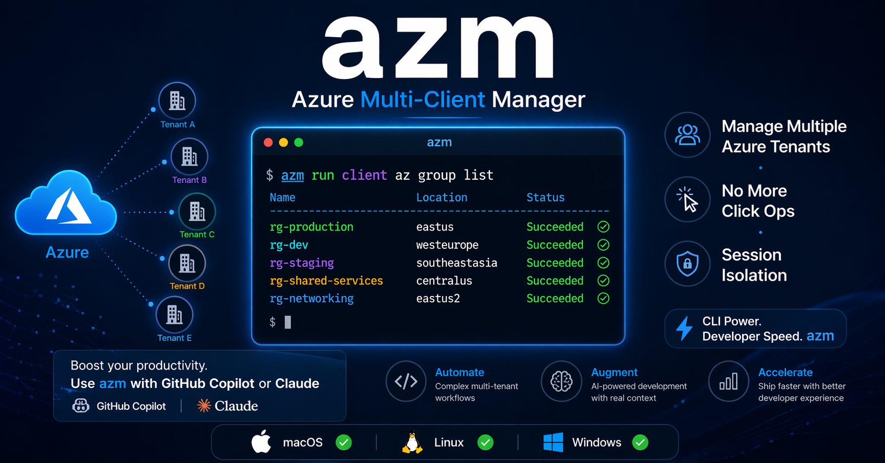

# azm - Azure Multi-Client CLI Manager

[](LICENSE)

[](https://github.com/realsanket/azm-client-manager)

Manage multiple Azure tenants and subscriptions from one terminal with isolated profiles per client.

azm supports two installer-selectable modes:

- Full mode: run read and write Azure CLI operations through azm.
- Readonly mode: run read-only Azure CLI queries through azm; destructive verbs are blocked.



---

## Quick Start

### Install (interactive mode selection)

macOS / Linux:

```bash
curl -fsSL https://raw.githubusercontent.com/realsanket/azm-client-manager/main/install.sh | bash
```

Windows (PowerShell):

```powershell
irm https://raw.githubusercontent.com/realsanket/azm-client-manager/main/install.ps1 | iex
```

If you do not pass a mode flag and your terminal is interactive, installer asks you to choose:

- Full mode
- Readonly mode

### Install with explicit mode flags

macOS / Linux:

```bash
# Full mode
curl -fsSL https://raw.githubusercontent.com/realsanket/azm-client-manager/main/install.sh | bash -s -- --install-full

# Readonly mode
curl -fsSL https://raw.githubusercontent.com/realsanket/azm-client-manager/main/install.sh | bash -s -- --install-readonly
```

Windows (PowerShell):

```powershell
# Full mode
Invoke-Expression "& { $(irm https://raw.githubusercontent.com/realsanket/azm-client-manager/main/install.ps1) -InstallFull }"

# Readonly mode
Invoke-Expression "& { $(irm https://raw.githubusercontent.com/realsanket/azm-client-manager/main/install.ps1) -InstallReadonly }"
```

Clone/install alternative:

```bash
git clone https://github.com/realsanket/azm-client-manager.git
cd azm-client-manager
./install.sh --install-full
# or
./install.sh --install-readonly
```

```powershell
git clone https://github.com/realsanket/azm-client-manager.git
cd azm-client-manager
.\install.ps1 -InstallFull
# or
.\install.ps1 -InstallReadonly
```

### First commands

```bash
# Register clients
azm add acme acme.onmicrosoft.com admin@acme.com
azm add contoso contoso.com user@contoso.com

# Login
azm login acme contoso

# Run query
azm run acme az group list -o table

# Compare clients
azm compare acme contoso az group list -o json
```

---

## Mode Behavior Matrix

| Area | Full mode | Readonly mode |
| --- | --- | --- |
| `azm` command name | `azm` | `azm` |
| `azm run` with read-only verbs (`list`, `show`, `get`) | Allowed | Allowed |
| `azm run` with destructive verbs (`create`, `delete`, `update`, `deploy`, etc.) | Allowed | Blocked |
| `azm compare` with read-only verbs | Allowed | Allowed |
| `azm compare` with destructive verbs | Allowed | Blocked |
| azm management commands (`add`, `remove`, `set-sub`, `login`, etc.) | Allowed | Allowed |
| Runtime mode marker | `~/.azclients/install-mode` = `full` | `~/.azclients/install-mode` = `readonly` |

### Example outcomes

```bash
# Always allowed in both modes
azm run acme az vm show -g rg1 -n vm1 -o json

# Allowed only in full mode
azm run acme az group create -g rg-demo -l eastus
```

In readonly mode, blocked operations return a clear safety message before az command execution.

---

## Why azm

If you work across many tenants/subscriptions, azm helps with:

- Isolated credentials per client (`AZURE_CONFIG_DIR` per profile)
- Faster context switching without repeated manual account juggling
- Per-client command logs for audit/debugging
- Cross-client compare workflow for drift checks
- Optional readonly safety guardrails for query-focused workflows

---

## Features

- Isolated client profiles (`~/.azclients/profiles/<client>`)
- Bash and PowerShell support
- Multi-client login (`login`, `login-all`, `login-expired`)
- Token health checks (`check`, `check-expired`)
- Machine-readable listing (`azm list --names`, `azm list --json`)
- Optional masking for sensitive fields (`--mask` or `AZM_MASK_DETAILS=1`)
- Cross-client command compare (`azm compare`)
- Installer mode selection (`--install-full`, `--install-readonly`)

---

## Installation Details

### Prerequisites

- Azure CLI (`az`) installed and available on PATH
- macOS/Linux: Bash 3.2+
- Windows: PowerShell 5.1+ or PowerShell 7+
- Optional: `jq` (improves JSON diff readability in compare)

### Non-interactive installs

If installer runs in non-interactive mode and no mode flag is passed, installer fails and asks you to provide a mode explicitly.

Required flags:

- Bash: `--install-full` or `--install-readonly`
- PowerShell: `-InstallFull` or `-InstallReadonly`

### Switching modes later

Re-run installer with the opposite mode flag. Runtime command stays `azm`.

```bash
./install.sh --install-full
./install.sh --install-readonly
```

```powershell
.\install.ps1 -InstallFull
.\install.ps1 -InstallReadonly
```

---

## Usage

### Register a client

```bash
azm add <name> <tenant> <email> [subscription-id]
```

### Login

```bash
azm login <name> [name2 name3 ...]
azm login-all
azm login-expired
```

### Validate tokens

```bash
azm check <name> [name2 ...]
azm check-expired
```

### Run and compare commands

```bash
azm run [--mask] <name> az <subcommand> [flags]
azm compare <client1> <client2> az <subcommand> [flags]
```

### Other commands

```bash
azm list [--names|--json] [--mask]
azm status [--mask] [name]
azm set-sub <name> <sub-id>
azm switch <name>
azm remove <name>
azm log <name> [n]
azm version
azm help
```

### Privacy masking

Use `--mask` when printing client details in `list`, `run`, or `status` outputs:

```bash
azm list --mask
azm run --mask acme az group list -o table
azm status --mask acme
```

Enable masking globally for your shell session:

```bash
export AZM_MASK_DETAILS=1
```

---

## Copilot Skills

This repo includes three azm skill docs under `.github/skills/`:

| Skill | Purpose |
| --- | --- |
| `azm-client-manager` | Router skill. Detects installed mode and applies mode-appropriate guidance. |
| `azm-full-control` | Guidance for full mode, including mutating Azure CLI operations through azm. |
| `azm-readonly-safe` | Guidance for readonly mode; destructive Azure CLI verbs are blocked through azm. |

Mode detection for skills is based on `~/.azclients/install-mode`.

---

## Web UI (optional)

An optional browser UI lives under `azm-ui/`. It wraps the same `azm` CLI in a React + Express app so you can pick a client, run read-only Azure CLI commands, and manage tokens without leaving the browser.

```bash
cd azm-ui
npm install
npm run dev
```

Opens on http://localhost:5173, backend on port 3001.

Requires `azm` and Azure CLI on PATH, Node.js 20+.

See [`azm-ui/README.md`](azm-ui/README.md) for details.

---

## Team presets

The UI reads YAML recipe groups from [`team-presets/`](team-presets/). Each file defines a preset with a list of read-only `az` commands. Shipped examples:

| File | Focus |
| --- | --- |
| `general_team.yml` | Default cross-team read-only queries |
| `networking_team.yml` | VNets, subnets, NSGs, private endpoints, DNS |
| `compute_team.yml` | VMs, VMSS, AKS, container apps, web/function apps |
| `security_team.yml` | Key vaults, RBAC, policy, managed identities |

Preset schema:

```yaml
id: my_team
name: My Team
description: Optional one-line summary.
recipes:
  command:
    - label: Groups
      command: az group list -o table
    - label: Account
      command: az account show -o table
```

Drop new `.yml` / `.yaml` files into `team-presets/` and pick them in the UI Settings dialog. Multiple presets can be selected at once — recipes merge and dedupe by label + command.

---

## How It Works

```text
~/.azclients/
├── bin/
│   ├── azm
│   └── azm.ps1
├── install-mode                # full | readonly
├── clients.conf                # name|tenant|subscription|email
├── profiles/
│   ├── acme/
│   └── contoso/
└── logs/
    ├── acme.log
    └── contoso.log
```

When you run:

```bash
azm run acme az group list
```

azm sets `AZURE_CONFIG_DIR` to that client profile before calling Azure CLI.

---

## Token Expiration and Conditional Access

Some organizations enforce short token lifetimes. Recommended flow:

```bash
azm check-expired
azm login-expired
```

Use service principals for unattended automation where appropriate.

---

## Migration Notes

For existing users:

- Runtime command is still `azm`.
- Existing client/profile data remains under `~/.azclients`.
- New installers write `~/.azclients/install-mode`.
- If mode file is missing (older install), rerun installer with explicit mode to standardize behavior.

---

## Troubleshooting

| Symptom | Likely Cause | Fix |
| --- | --- | --- |
| Auth error on `azm run` | Session expired | `azm login <name>` or `azm login-expired` |
| `azm run` blocks operation in readonly mode | Destructive verb | Switch to full mode install or use native az directly |
| Wrong subscription | Stale configured subscription | `azm set-sub <name> <sub-id>` |
| `az` command not found | Azure CLI missing | Install Azure CLI |

---

## Contributing

1. Fork repository.
2. Create feature branch.
3. Make changes.
4. Validate scripts locally (`bash -n`, PowerShell parse checks).
5. Open PR.

---

## License

[MIT](LICENSE)
